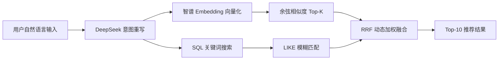

# 🌍 WanderLust AI

<div align="center">

**AI 驱动的智能旅行目的地搜索与行程规划平台**

*"不仅仅是搜索，更是对未知的探索"*

[](https://spring.io/projects/spring-boot)
[](https://vuejs.org/)
[](https://openjdk.org/)
[](https://www.mysql.com/)
[](https://deepseek.com/)
[](https://open.bigmodel.cn/)

</div>

---

## 📖 项目简介

WanderLust AI 是一个基于 **RAG（检索增强生成）** 架构的智能旅游平台。它不同于传统的表单筛选搜索，而是让用户用**自然语言**描述心中想要的旅行体验（例如"想去一个像《星际穿越》里那样孤独的地方"），系统通过 **LLM 意图理解 → 双路混合检索 → RRF 融合排序** 三个步骤，精准匹配最合适的目的地，并能调用 AI 大模型自动生成个性化的 Markdown 行程规划。

> 🎯 本项目是 **AI 大模型应用开发** 方向的实战作品，展示了 LLM API 调用、Embedding 向量检索、混合搜索融合算法等核心能力。

## 🧠 核心亮点

### 1. 智能意图重写 (Query Rewriting)

用户输入自然语言 → DeepSeek V3 将其转化为数据库可理解的结构化关键词

```
用户: "最近太累了想找个安静的地方放松一下"
  ↓ DeepSeek 意图重写
关键词: "治愈 放松 休闲 宁静 自然"
```

### 2. 双路并行混合检索 (Hybrid Search)

| 检索路径 | 技术 | 作用 |
|---------|------|------|
| 🧬 语义向量检索 | 智谱 GLM-4 Embedding + 余弦相似度 | 捕获语义相关性（氛围、情感） |
| 📝 关键词全文检索 | MySQL LIKE + JPA Query | 精确匹配名称、国家、描述 |
| 🔀 RRF 融合排序 | Reciprocal Rank Fusion | 动态加权合并两路结果 |



### 3. AI 行程自动生成

选定目的地后，DeepSeek 根据天数、预算、同行人员自动生成结构化的 Markdown 行程，包含每日景点推荐、美食攻略等。

### 4. 智能月度推荐

根据当前系统月份，自动推荐当月最适合前往的目的地（如 4 月推荐京都樱花季）。

## 🛠️ 技术栈

### 后端
| 技术 | 版本 | 用途 |
|------|------|------|
| Spring Boot | 3.2.1 | 核心框架 |
| Spring Data JPA | - | ORM & 数据访问 |
| Spring Security | - | 认证与授权 |
| MySQL | 8.0 | 关系数据库 |
| Lombok | - | 简化 POJO |
| EasyExcel | 3.3.2 | Excel 批量导入 |

### 前端
| 技术 | 版本 | 用途 |
|------|------|------|
| Vue 3 | 3.5 | 前端框架 (Composition API) |
| Vite | 7.3 | 构建工具 |
| Element Plus | 2.13 | UI 组件库 |
| Tailwind CSS | 3.4 | 原子化 CSS |
| GSAP | 3.14 | 高级动画 |
| Pinia | 3.0 | 状态管理 |
| Markdown-it | 14.1 | AI 回复 Markdown 渲染 |

### AI 服务
| 模型 | API | 用途 |
|------|-----|------|
| DeepSeek V3 | `api.deepseek.com` | 意图重写 + 行程生成 |
| 智谱 GLM-4 Embedding | `open.bigmodel.cn` | 文本向量化 (1024维) |

## 🚀 快速开始

### 环境要求

- **JDK 17+**
- **Node.js 20.19+** / 22.12+
- **MySQL 8.0+**
- **Maven 3.8+**

### 1. 克隆项目

```bash
git clone <your-repo-url>
cd wander-lust-ai
```

### 2. 配置数据库 & API Key

编辑 `backend/src/main/resources/application.yml`：

```yaml
spring:
  datasource:
    url: jdbc:mysql://localhost:3306/wanderlust?useUnicode=true&characterEncoding=utf-8&useSSL=false&serverTimezone=Asia/Shanghai
    username: root
    password: 你的数据库密码

deepseek:
  api:
    key: 你的DeepSeek_API_Key

zhipu:
  api:
    key: 你的智谱_API_Key
```

> ⚠️ **安全提示**：生产环境请使用环境变量注入密钥，不要将 Key 提交至 Git。

### 3. 创建数据库

```sql
CREATE DATABASE IF NOT EXISTS wanderlust DEFAULT CHARACTER SET utf8mb4;
```

### 4. 启动后端

```bash
cd backend
./mvnw spring-boot:run
```

首次启动时，`DataSeeder` 会自动向数据库插入 5 条带向量的种子数据。

启动成功后访问：`http://localhost:8080`

### 5. 启动前端

```bash
cd front
npm install
npm run dev
```

访问：`http://localhost:5173`

## 📁 项目结构

```
wander-lust-ai/
├── backend/                          # Spring Boot 后端
│   ├── src/main/java/com/wanderlust/
│   │   ├── WanderLustApplication.java    # 启动类
│   │   ├── config/
│   │   │   ├── SecurityConfig.java       # 安全配置
│   │   │   ├── DataSeeder.java           # 种子数据自动播种
│   │   │   ├── DataInitializer.java      # 初始化器
│   │   │   └── WebConfig.java            # CORS 配置
│   │   ├── controller/
│   │   │   ├── AIController.java         # AI 混合搜索 & 推荐接口
│   │   │   ├── AiPlannerController.java  # AI 行程规划接口
│   │   │   ├── AuthController.java       # 登录/注册/用户信息
│   │   │   ├── BookingController.java    # 预订管理
│   │   │   ├── DestinationController.java # 目的地 CRUD
│   │   │   ├── FavoriteController.java   # 收藏管理
│   │   │   ├── ReviewController.java     # 评论管理
│   │   │   └── AdminController.java      # 管理员接口
│   │   ├── entity/                       # JPA 实体
│   │   │   ├── User.java
│   │   │   ├── Destination.java
│   │   │   ├── Booking.java
│   │   │   ├── Favorite.java
│   │   │   └── Review.java
│   │   ├── service/                      # 业务逻辑层
│   │   │   ├── KnowledgeService.java     # 🔥 核心：混合检索引擎
│   │   │   ├── DeepSeekService.java      # DeepSeek API 调用
│   │   │   ├── ZhipuService.java        # 智谱 Embedding API
│   │   │   ├── AuthService.java          # 认证逻辑
│   │   │   ├── DestinationService.java   # 目的地 & Excel 导入
│   │   │   └── impl/                     # 服务实现
│   │   ├── repository/                   # JPA Repository
│   │   └── utils/
│   │       ├── RRFAlgorithm.java         # 🔥 RRF 融合排序算法
│   │       ├── VectorStore.java          # 余弦相似度计算
│   │       └── Result.java               # 统一响应封装
│   └── src/main/resources/
│       └── application.yml               # 核心配置文件
│
├── front/                               # Vue 3 前端
│   ├── src/
│   │   ├── views/
│   │   │   ├── HomeView.vue              # 🔥 首页：搜索 + 推荐
│   │   │   ├── destination/
│   │   │   │   └── DestinationDetail.vue  # 目的地详情页
│   │   │   ├── auth/                     # 登录/注册
│   │   │   ├── user/                     # 个人中心
│   │   │   └── admin/                    # 管理后台
│   │   ├── components/
│   │   │   ├── AiPlanner.vue             # 🔥 AI 行程规划抽屉
│   │   │   ├── DestinationCard.vue       # 目的地卡片
│   │   │   ├── Navbar.vue                # 导航栏
│   │   │   └── Adminbar.vue              # 管理侧边栏
│   │   ├── router/index.js              # 路由 + 守卫
│   │   └── stores/userStore.js          # Pinia 用户状态
│   └── index.html
│
└── README.md
```

## 🔥 核心算法详解

### RRF (Reciprocal Rank Fusion) 融合排序

```java
// 动态权重策略
double sqlWeight = isSpecific ? 3.0 : 1.0;   // 精确搜索 → SQL 权重高
double vectorWeight = isSpecific ? 1.0 : 2.0;  // 模糊搜索 → 向量权重高

// RRF 公式
score = weight × (1 / (k + rank))
// k = 60，保证排名靠后的结果衰减平缓
```

当用户搜索包含年份等精确信息时，SQL 路权重提升至 3 倍；当用户用模糊的自然语言描述时，向量语义路权重提升至 2 倍。

### 向量检索流程

1. **离线阶段**：智谱 Embedding-2 将每个目的地的 `标题 + 国家 + 描述` 编码为 1024 维向量，存入 MySQL `LONGTEXT` 字段
2. **在线阶段**：用户查询词实时向量化 → 与内存索引中的所有向量计算余弦相似度 → 阈值过滤(0.38) → Top-10


## 📝 API 概览

| 方法 | 路径 | 说明 |
|------|------|------|
| GET | `/api/destinations/search?query=` | 🔥 AI 混合搜索 |
| GET | `/api/destinations/recommend` | 月度智能推荐 |
| POST | `/api/ai/plan` | AI 生成行程 |
| POST | `/auth/login` | 用户登录 |
| POST | `/auth/register` | 用户注册 |
| GET | `/destinations` | 获取全部目的地 |
| GET | `/destinations/:id` | 目的地详情 |
| POST | `/bookings/create` | 创建预订 |
| POST | `/favorites/toggle` | 收藏/取消 |
| POST | `/reviews/add` | 发表评论 |
| POST | `/admin/import` | Excel 批量导入 |

## 📄 License

MIT License

---

<div align="center">

**Built with ❤️ by 杨十一** · 2026

*如果这个项目对你有帮助，请给一个 ⭐ Star*

</div>
